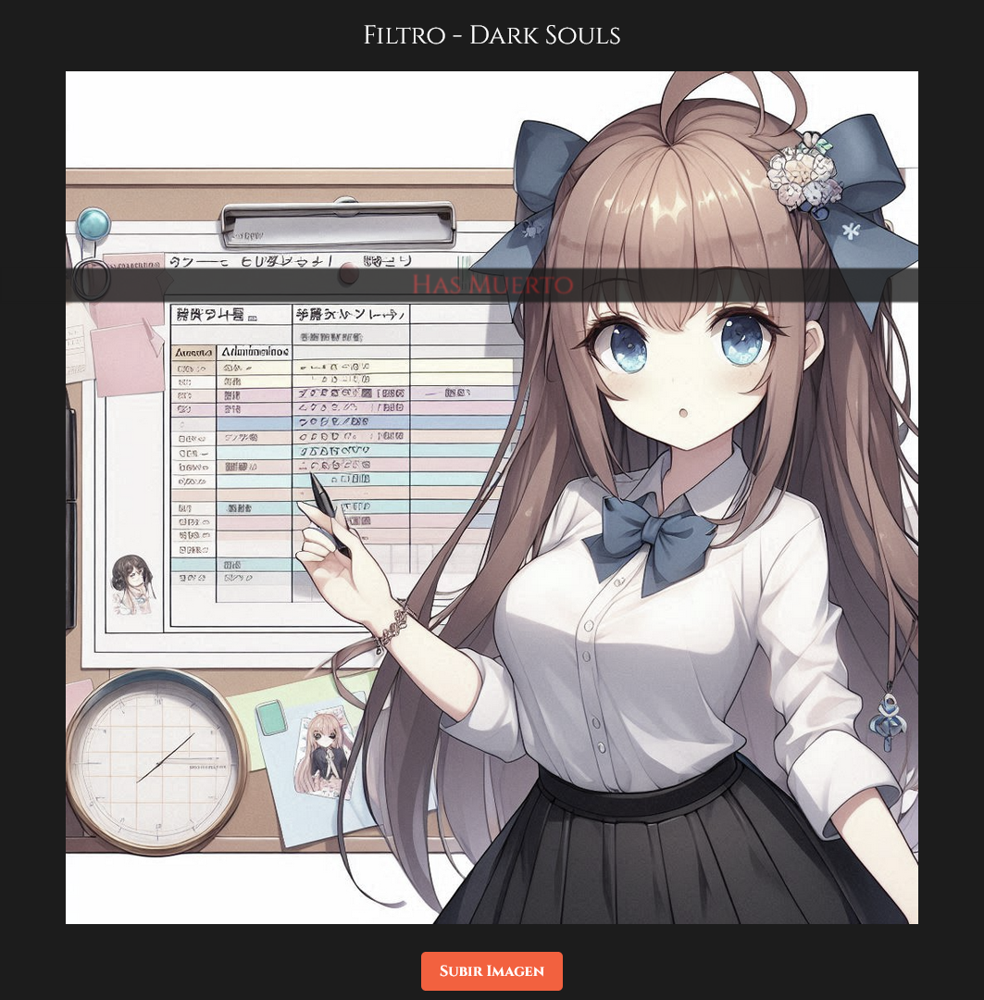
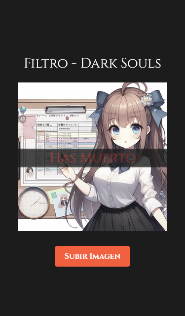

# Filtro - Dark Souls

¡Saludos! Esta es la página para aplicar un Filtro de pantalla tipo Dark Souls. De momento es una versión en desarrollo que busca adaptar las pantallas más iconicas de la serie a modo de filtro para cualquier imagen.

## Tabla de contenidos

- [Resumen](#Resumen)
  - [Capturas de Pantalla](#capturas-de-pantalla)
- [Detalles](#detalless)
  - [Construido Con](#built-with)
  - [Tareas Pendientes](#tareas-pendientes)
- [Autor](#autor)

## Resumen

"Filtro - Dark Souls" es un proyecto independiente, creado principalmente para entretener y para la creación de contenido en internet de tipo "Meme".

Aun esta en desarrollo y puede que se agregen más funcionalidades a futuro.

### Capturas de Pantalla

Este es un ejemplo del filtro en una resolución de computadora de escritorio.

Este es un ejemplo del filtro en una resolución de computadora de móviles, en el ejemplo se usa una resolución de 375px.

## Detalles

### Construido Con

- Semantic HTML5 markup
- Flexbox
- CSS custom properties
- JavaScript

### Tareas Pendientes

- Agregar pantalla de "Victoria Conseguida".
- Agregar pantalla de "Señor Derrotado".
- Agregar pantallas afines.

## Autor

- GitHub - [hcolmenares](https://github.com/hcolmenares)
